# 🏗️ BuildMaster

A **modern, responsive construction company website** built using **React + Vite**, styled with **CSS**, and deployed on **GitHub Pages**.  
This project demonstrates frontend development, UI design, and deployment skills — created as part of my portfolio to showcase to recruiters.

🌐 **Live Demo**: [BuildMaster](https://mohitgadwe26.github.io/BuildMaster/)

---

## 📌 Features

- 🎨 Modern & responsive UI design
- 🖼️ Hero section with slideshow background
- ✨ Smooth transitions & animations
- 📱 Mobile-friendly layout
- 🔗 Easy navigation with smooth scroll
- 🚀 Deployed on GitHub Pages

---

## 🛠️ Tech Stack

- **Frontend**: React, Vite
- **Styling**: CSS3 (custom modules)
- **Deployment**: GitHub Pages
- **Version Control**: Git + GitHub

---

## 📂 Project Structure

# 🏗️ BuildMaster

A **modern, responsive construction company website** built using **React + Vite**, styled with **CSS**, and deployed on **GitHub Pages**.  
This project demonstrates frontend development, UI design, and deployment skills — created as part of my portfolio to showcase to recruiters.

🌐 **Live Demo**: [BuildMaster](https://mohitgadwe26.github.io/BuildMaster/)

---

## 📌 Features

- 🎨 Modern & responsive UI design
- 🖼️ Hero section with slideshow background
- ✨ Smooth transitions & animations
- 📱 Mobile-friendly layout
- 🔗 Easy navigation with smooth scroll
- 🚀 Deployed on GitHub Pages

---

## 🛠️ Tech Stack

- **Frontend**: React, Vite
- **Styling**: CSS3 (custom modules)
- **Deployment**: GitHub Pages
- **Version Control**: Git + GitHub

---

## 📂 Project Structure

BuildMaster/
├── src/
│ ├── assets/ # Images and static files
│ ├── components/ # Reusable components
│ ├── pages/ # Main pages
│ ├── App.jsx # Root component
│ └── main.jsx # Entry point
├── public/ # Public assets
├── package.json # Dependencies & scripts
├── vite.config.js # Vite configuration
└── README.md # Project documentation

---

## 🚀 Getting Started

Follow these steps to run the project locally:

### 1️⃣ Clone the repository

```bash
git clone https://github.com/MohitGadwe26/BuildMaster.git
cd BuildMaster
2️⃣ Install dependencies
npm install
3️⃣ Run in development mode
npm run dev
4️⃣ Build for production
npm run build
5️⃣ Deploy to GitHub Pages
npm run deploy

---

## 📸 Screenshots

### 🏠 Home Page
<p align="center">
  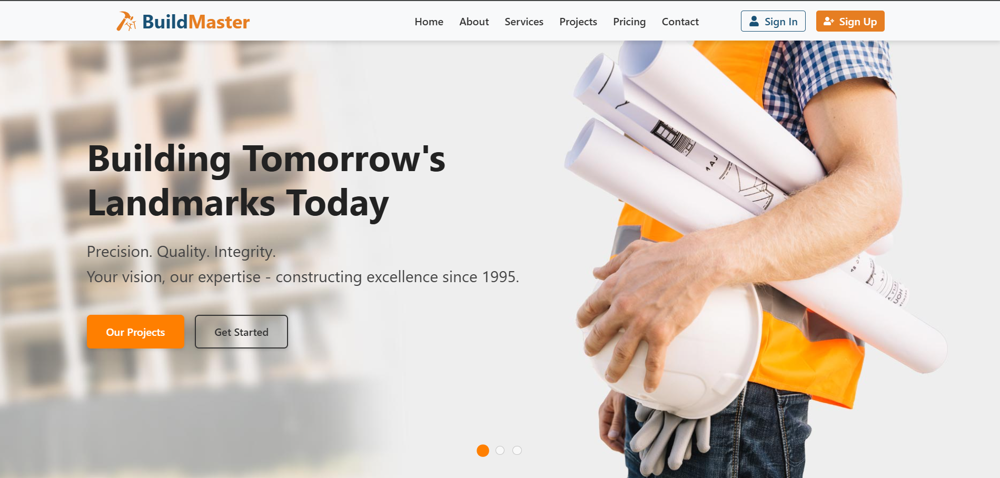
  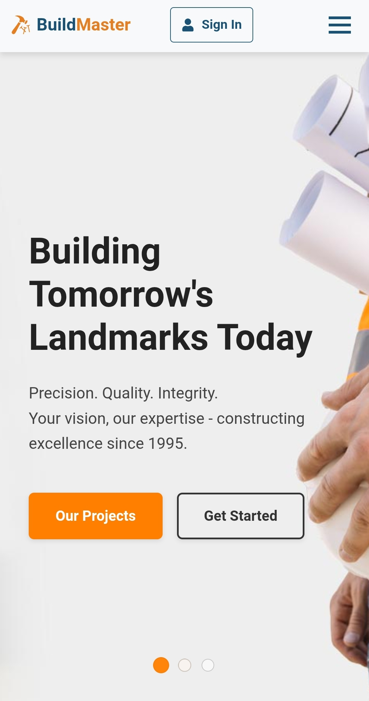
</p>

### ℹ️ About Page
<p align="center">
  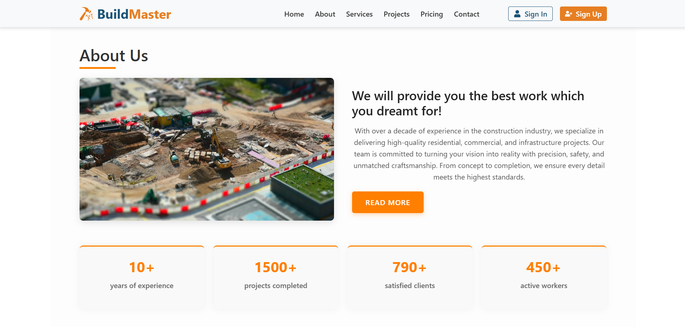
  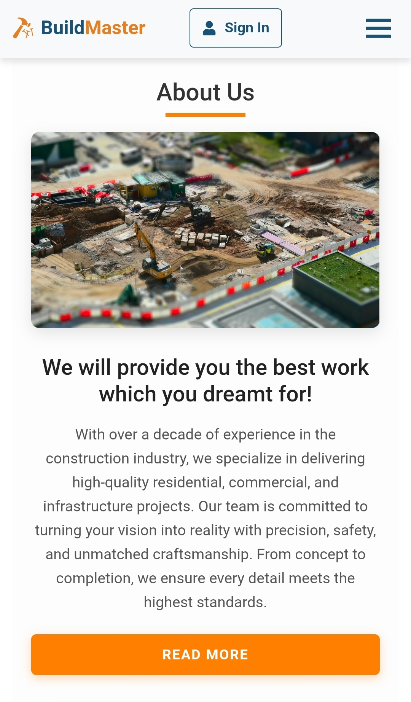
</p>

### 🛠️ Services Page
<p align="center">
  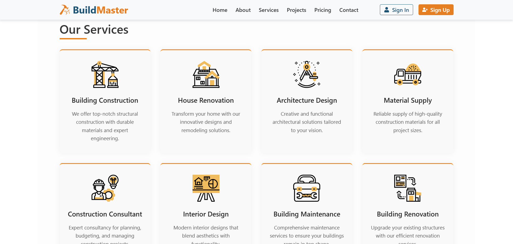
  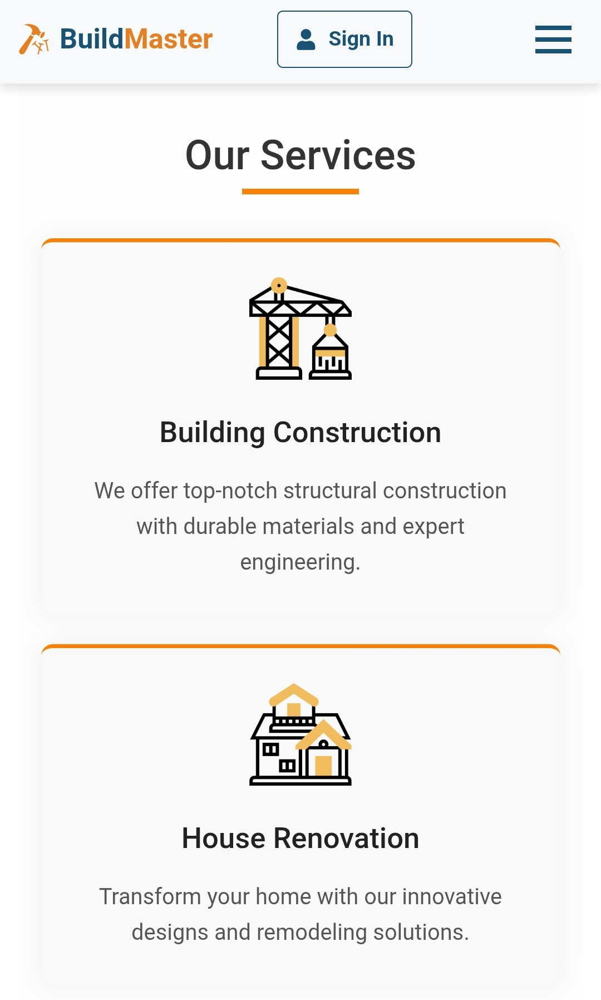
</p>

### 🏗️ Projects Page
<p align="center">
  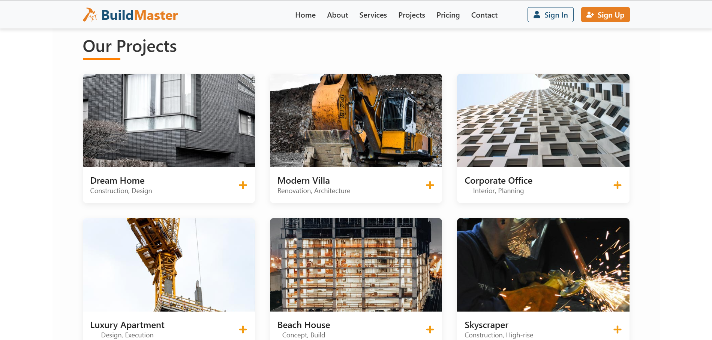
  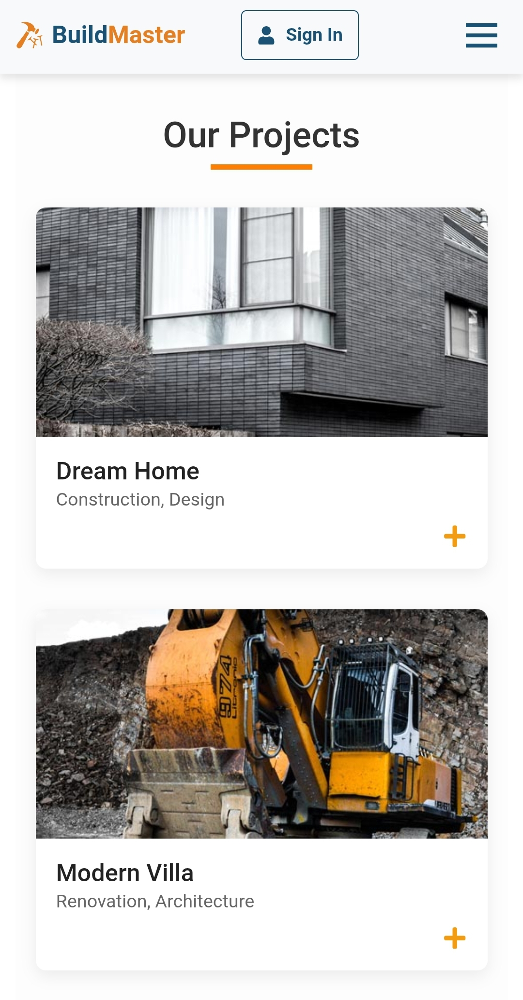
</p>

### 💰 Pricing Page
<p align="center">
  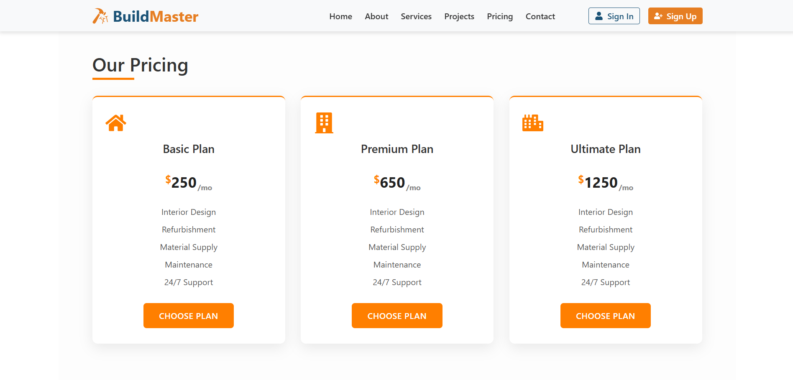
  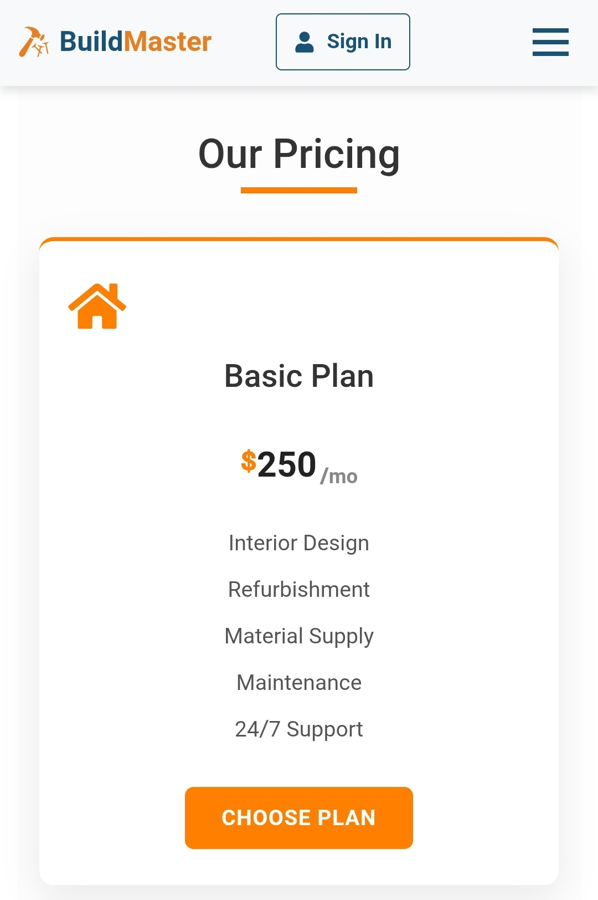
</p>

### 📞 Contact Page
<p align="center">
  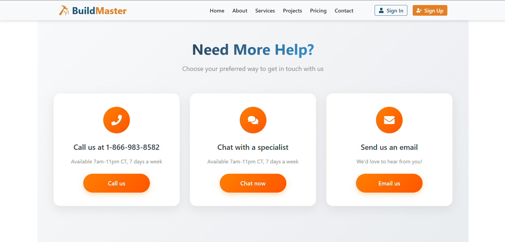
  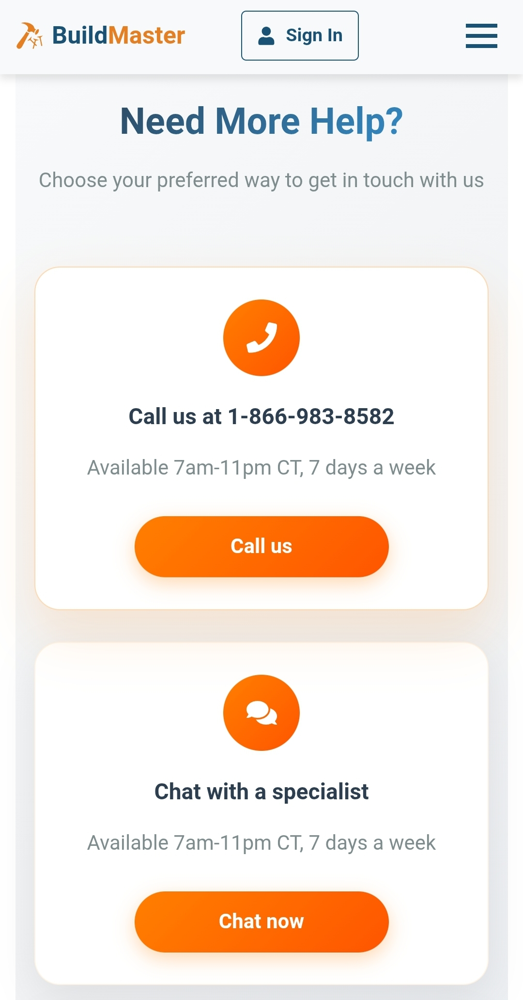
</p>

### 🔐 Login Page
<p align="center">
  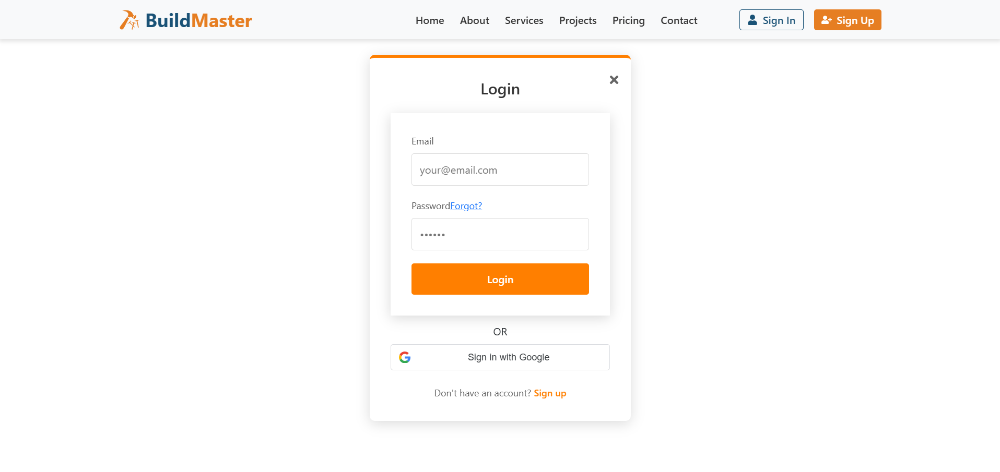
  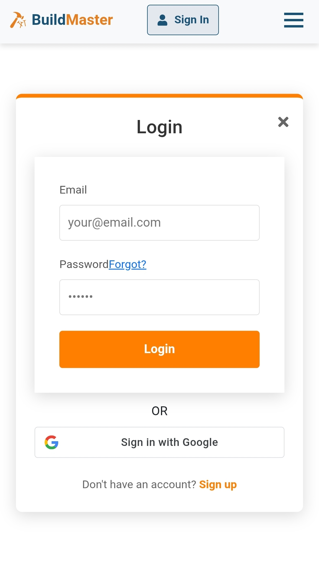
</p>

### 📝 Signup Page
<p align="center">
  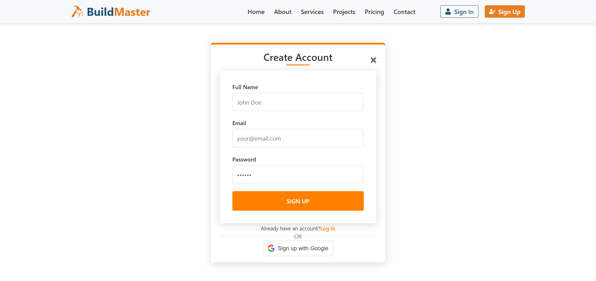
  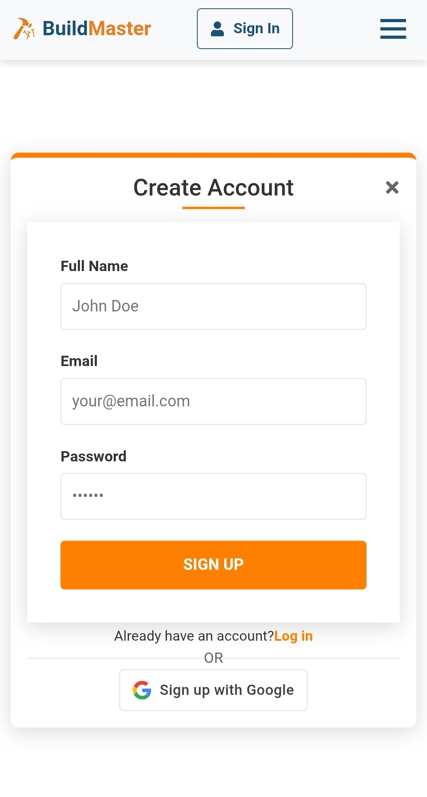
</p>

Copyright (c) 2025 Mohit Gadwe

This project is for educational and portfolio purposes only.
Recruiters and interviewers are welcome to view this code
for evaluation purposes.

Unauthorized copying, use, modification, or redistribution of this code
without explicit permission is strictly prohibited.

This project is provided "as is" without warranty of any kind.

All Rights Reserved.

👨‍💻 Author
Mohit Gadwe
📧 Email: smohitg26@gmail.com
💼 LinkedIn: https://www.linkedin.com/in/mohit-gadwe/
🌐 Portfolio: https://mohitgadwe26.github.io/BuildMaster/

```
